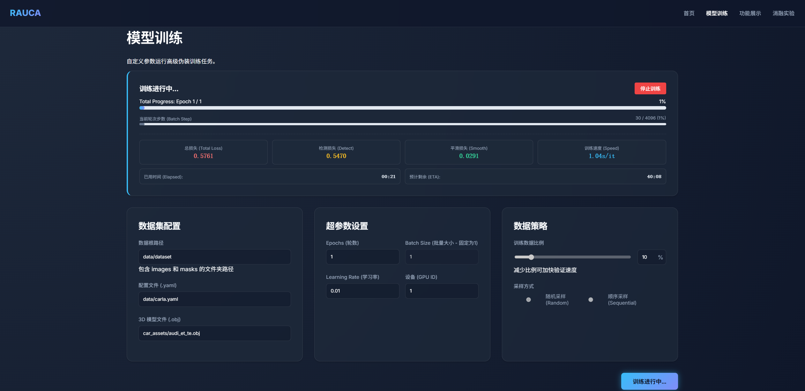
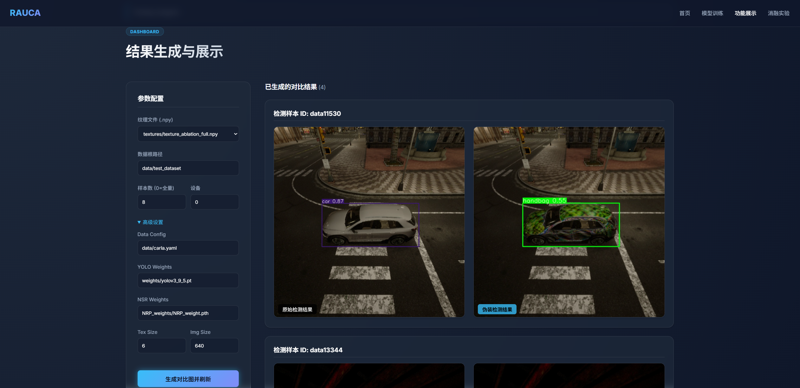
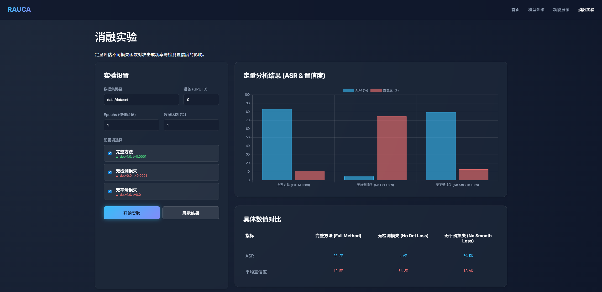
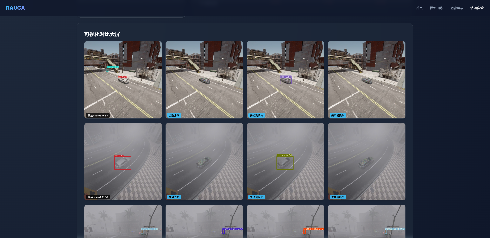

# RAUCA: 基于 Web 的对抗伪装攻击与可视化系统

本项目是 **RAUCA (Robust and Accurate UV-map-based Camouflage Attack)** 的工程化增强版本。

为了降低对抗样本研究的使用门槛，我们在底层的深度学习算法之上，构建了一套完整的 **Web 可视化交互系统**。本项目将**计算机视觉（目标检测）**、**图形学（神经渲染）**与**对抗攻击（优化算法）** 深度融合，提供了一个从模型训练到效果验证的一站式平台。

## 🧠 核心技术架构

本项目底层逻辑包含三个核心的深度学习与计算机视觉模块：

### 1. 目标检测 (Object Detection)
* **角色**：被攻击对象（Victim Model）。
* **技术细节**：项目集成了经典的 **YOLOv3** 目标检测器。在训练伪装纹理时，我们利用 YOLOv3 的检测损失（Detection Loss）作为优化目标；在评估阶段，我们观察它在面对伪装车辆时的检测置信度变化，以衡量攻击效果。

### 2. 神经渲染器 (Neural Renderer Plus, NRP)
* **角色**：环境模拟与可微渲染桥梁。
* **技术细节**：这是原项目的创新点。为了使生成的伪装在物理世界（不同光照、天气）中依然有效，我们训练了一个基于 **U-Net** 结构的神经渲染器（NRP）。
* **功能**：它不仅负责将 3D 车辆模型的纹理投影到 2D 图像上，还负责学习并模拟真实环境的光影和天气特征。由于它是**可微分**的，梯度可以通过渲染器反向传播到纹理贴图上。

### 3. 对抗伪装生成 (Adversarial Camouflage Generation)
* **角色**：核心训练任务。
* **技术细节**：这是一个基于优化的深度学习任务。
    * **输入**：初始化的随机纹理或特定图案。
    * **过程**：系统将纹理贴在 3D 模型上，通过 NRP 渲染成图像，输入 YOLOv3 计算损失。
    * **优化**：通过梯度下降法（Gradient Descent）不断更新 **UV 纹理贴图**的像素值，直到该纹理能最大程度地欺骗检测器（使其无法识别车辆）。

---

## ✨ Web 系统功能特性

基于上述复杂的底层技术，我们封装了 Flask 后端，提供了以下可视化功能模块：

### 1. 可视化模型训练 (Training Dashboard)
将复杂的对抗训练过程图形化。
* **实时监控**：在网页上实时查看总损失、检测损失（针对 YOLO）和平滑损失（针对纹理物理可打印性）的变化曲线。
* **参数热更**：支持在界面上调整 Epochs、Learning Rate 等超参数，支持配置数据采样策略（Data Fraction）以快速验证实验想法。


<div align="center"><i>图 1: 可视化训练控制台，支持实时 Loss 监控与参数热更</i></div>

### 2. 攻击效果可视化 (Results Gallery)
一键验证生成的伪装纹理对 YOLOv3 的攻击效果。
* **直观对比**：系统会自动渲染带有伪装的车辆，并运行检测器。界面左侧展示原始车辆的检测框，右侧展示伪装车辆的检测结果（通常检测框消失或置信度极低）。


<div align="center"><i>图 2: 攻击效果验证（左：原始识别结果，右：施加伪装后的攻击效果）</i></div>

### 3. 自动化消融实验 (Auto Ablation Study)
全自动化的实验分析工具，用于定量评估不同损失函数对攻击效果的影响。
* **一键运行**：自动并行测试 "完整方法" (Full)、"无检测损失" (No Det)、"无平滑损失" (No Smooth) 等多种配置。
* **图表分析**：自动生成 ASR (攻击成功率) 和置信度的对比柱状图。
* **可视化报告**：针对同一张图片，横向展示不同配置下的攻击效果差异。

**[定量分析]**


<div align="center"><i>图 3-1: 实验配置选择与定量指标分析（ASR & 置信度柱状图）</i></div>

<br>

**[定性对比]**


<div align="center"><i>图 3-2: 多组实验配置下的攻击效果可视化大屏对比</i></div>

---

## 🛠️ 环境安装与配置

本项目基于 Python 3.9 和 PyTorch 构建，涉及 CUDA 编译操作，请严格按照以下步骤配置。

### 1. 基础环境设置

推荐使用 Conda 创建虚拟环境：

```bash
conda create -n RAUCA python=3.9
conda activate RAUCA
```

### 2. 安装 Neural Renderer (核心依赖)

本项目依赖 `neural_renderer` 进行 3D 渲染，需要进行本地编译安装。请确保您的系统已安装 CUDA (推荐 11.x 版本)。

进入 `src` 目录并执行以下操作：

```bash
cd src
git clone https://github.com/fengx1e/Neural_Renderer_RAUCA.git

# 安装 PyTorch (请根据您的 CUDA 版本调整，以下为 CUDA 11.8 示例)
conda install pytorch==2.0.0 torchvision==0.15.0 torchaudio==2.0.0 pytorch-cuda=11.8 -c pytorch -c nvidia

cd neural_renderer_RAUCA

# 安装编译工具 Ninja
sudo apt install ninja-build

# 安装 neural_renderer
# 注意：如果遇到编译错误，请检查 CUDA_HOME 环境变量或尝试多次运行安装命令
python setup.py install
ninja -f build/temp.linux-x86_64-cpython-39/build.ninja

# 再次运行以确认安装完整 (有时候第一次编译不完全)
python setup.py install
ninja -f build/temp.linux-x86_64-cpython-39/build.ninja
python setup.py install

cd ..
```

### 3. 安装其他依赖

返回 `src` 目录并安装项目所需的其他 Python 库：

```bash
conda env update --file environment.yml
```

### 4. 准备模型权重文件

请下载 YOLOv3 和 Neural Renderer 的预训练权重，并放入指定目录：

1.  **YOLOv3 权重 (检测器参数)**:
    * **下载地址**: [YOLOv3 Weights (v9.5.0)](https://github.com/ultralytics/yolov3/releases/download/v9.5.0/yolov3.pt)
    * **放置位置**: 下载后请重命名为 `yolov3_9_5.pt`，并将其移动到 `src/weights/` 目录下。

2.  **NRP 权重 (神经渲染器参数)**:
    * **下载地址**: [NRP_weights](https://pan.baidu.com/s/1iKtlv44Uq_1YcQyLH0SSlQ?pwd=e17m)
    * **放置位置**: 请确保 `src/NRP_weights/` 目录下存在 `NRP_weight.pth` 文件。

## 🚀 运行系统

一切准备就绪后，您可以通过以下命令启动 Web 可视化系统：

```bash
cd src
python run_main.py
```

终端显示启动成功后，请在浏览器中访问：
👉 **http://localhost:5000**

### 快速使用指南

1.  **首页导航**: 打开首页，您将看到三个核心功能入口：模型训练、功能展示、消融实验。
2.  **开始训练 (Model Training)**:
    * 进入 "模型训练" 页面。
    * 在 "数据集配置" 中确认路径 (默认 `data/dataset`)。
    * 在 "超参数设置" 中调整 Epochs (建议初次尝试设为 1 或 5) 和显卡设备 ID。
    * 点击 **"开始训练"** 按钮。
    * 观察页面顶部的进度条和实时的 Loss 数值变化。训练完成后，生成的纹理文件会自动保存在 `src/textures/` 目录下。
3.  **查看结果 (Results Gallery)**:
    * 进入 "功能展示" 页面。
    * 在 "纹理文件" 下拉菜单中，选择刚才训练生成的 `.npy` 文件。
    * 点击 **"生成对比图"**。系统将调用后台脚本，对测试集图片进行渲染和检测。
    * 页面将展示左右对比图：左侧为原始检测结果，右侧为施加伪装后的检测结果，您可以直观地看到车辆是否成功“隐身”。
4.  **运行消融实验 (Ablation Study)**:
    * 进入 "消融实验" 页面。
    * 勾选您想要对比的实验配置 (例如同时勾选 "完整方法" 和 "无检测损失")。
    * 点击 **"开始实验"**。
    * 系统将自动串行执行多个训练任务，并计算 ASR (攻击成功率) 等指标。等待完成后，页面会自动刷新展示对比柱状图和详细的视觉对比样本。

## 📂 目录结构说明

以下是本项目关键文件和目录的功能说明：

* **src/run_main.py**: Web 程序的启动入口脚本。
* **src/app.py**: Flask 后端核心逻辑，负责处理前端请求、任务调度、子进程管理和状态同步。
* **src/train_camouflage.py**: 对抗伪装生成的核心训练脚本 (Camouflage Generation)。
* **src/NRP_training.py**: 神经渲染器 (NRP) 的训练脚本，用于预训练 U-Net 渲染网络。
* **src/gen_camo_detect.py**: 可视化评估工具。负责将纹理贴回车辆，渲染图像并运行 YOLO 检测以生成对比图。
* **src/templates/**: Web 前端页面模板 (包含 Home, Training, Results, Ablation 等页面)。
* **src/textures/**: 存放训练生成的对抗纹理文件 (`.npy`)。
* **src/compare_out/**: Web 系统专用的临时目录，用于存放生成的对比结果图片以供前端展示。
* **src/weights/**: 存放目标检测器 (YOLOv3) 的预训练权重。
* **src/NRP_weights/**: 存放神经渲染器 (NRP) 的预训练权重。